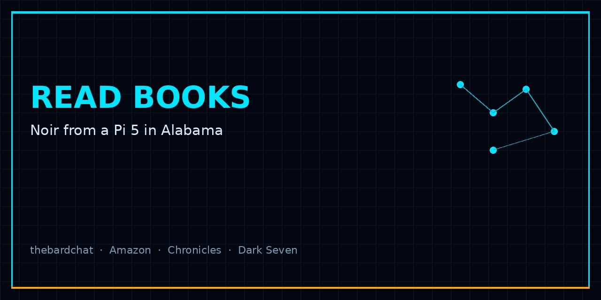

# read-books

### Noir from a Pi 5 in Alabama — read Shane Brazelton's books in one place.

---

**read-books** is the public reading desk for thebardchat — Volume One on Amazon, the noir song cycle, DARK SEVEN, and the live MEGA chronicles.

## Start reading

| Work | What it is | Door |
|------|------------|------|
| **You Probably Think This Book Is About You** | 55 noir vignettes · ego, identity, the American South | [Amazon](https://www.amazon.com/Probably-Think-This-Book-About/dp/B0GT25R5FD) · [repo](https://github.com/thebardchat/you-probably-think-this-book-is-about-you) |
| **…This Song Is About You Too** | Volume Two · noir song cycle | [Amazon](https://a.co/d/0fZzwiAd) · [site](https://thebardchat.github.io/you-probably-think-this-song-is-about-you-too/) |
| **DARK SEVEN** | Volume Three · noir blood comic | [site](https://thebardchat.github.io/dark_seven/) · [repo](https://github.com/thebardchat/dark_seven) |
| **MEGA Crew Stories** | AI noir audiobook chronicles · live | [repo](https://github.com/thebardchat/mega-crew-stories) · [Discussions](https://github.com/thebardchat/mega-crew-stories/discussions/3) · [Discord](https://discord.gg/BTZZrG4MtV) |

**Live site:** [thebardchat.github.io/read-books](https://thebardchat.github.io/read-books/)

## Stack

Static GitHub Pages. Same visual language as [thebardchat.github.io](https://thebardchat.github.io) — charcoal, cyan `#00e5ff`, Space Grotesk / Orbitron / JetBrains Mono.

## Acknowledgments

Built by **Shane Brazelton** (thebardchat) with Claude. Faith. Family. Sobriety. Local AI. Hazel Green, Alabama.

## License

MIT — see [LICENSE](LICENSE). Book content remains under its own publication rights on Amazon and related repos.
